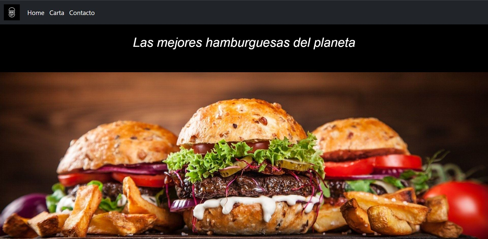
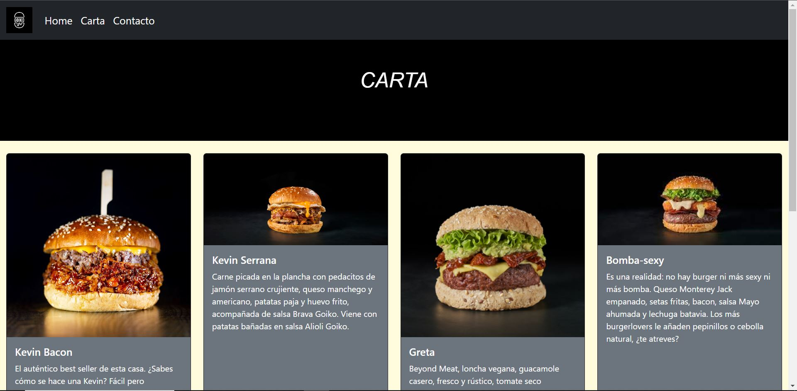
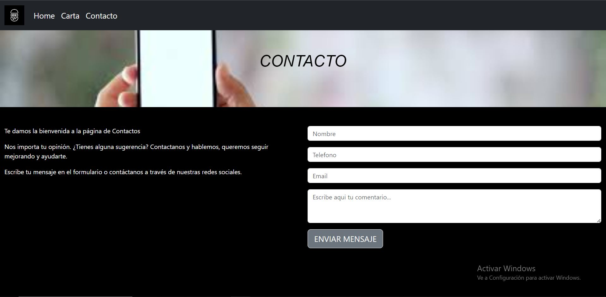
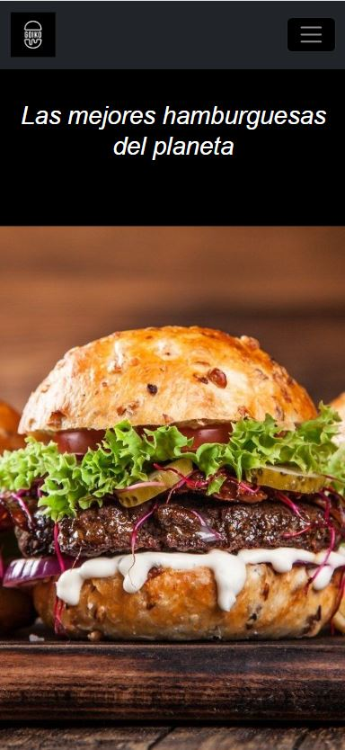
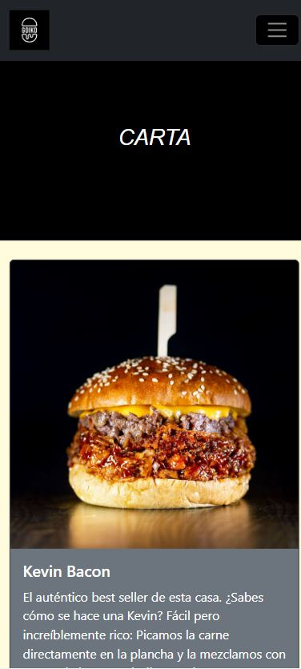
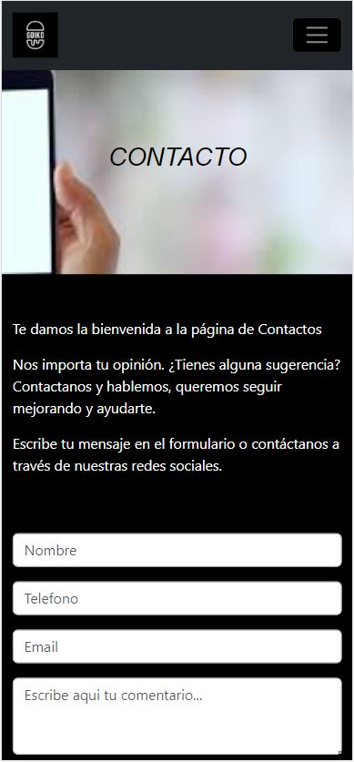

# Carta-Restaurante

Creación de una carta/menú de un restaurante digital.

# **Objetivo**

Crear una carta/menu para un restaurante digital.

# **Sobre el proyecto**

Se ha implemmetado una web sobre un restaurante de hamburguesas, siendo en su totalidad creada con elementos BOOSTRAP y siendo 100% responsive.

# **Vistas**

home.index 

carta.html

contacto.html 

**Responsive**

home.index 

carta.html

contacto.html 

